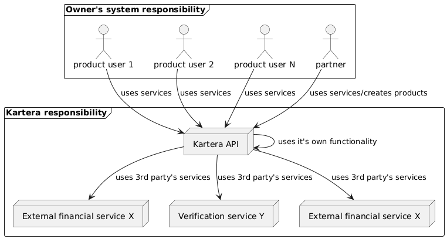

## Architecture

The general architecture of the service is straightforward—the service provides a simplified interface between other financial services
at the same time providing a lot of other functionality not available in them (like
rewards, webhook notification, verification, etc.).

In general schema of communication can be presented like this:

1. The owner of aa business (or someone on his behalf) performs the initial onboarding 
in the system. A `Partner` and `product` are created automatically after verification.
2. After validation, he registers its users in the system as `product users`
3. `Product users` and `partner` (or `partner users`) perform all required operations 
in the system with the help of Kartera UI (available for `partners` only, with login-based authentication) () or
Kartera API (available for `partners` and `product users`, with Api-Key-based authentication).
**NOTE:** the key aspect here is that all requests of `product-users` are proxied through owner's system, 
with his UI accepting their requests and redirecting to Kartera API
4. Kartera API performs some requests with help of own functionality some with help of external services
(no one from Kartera API users should care about)