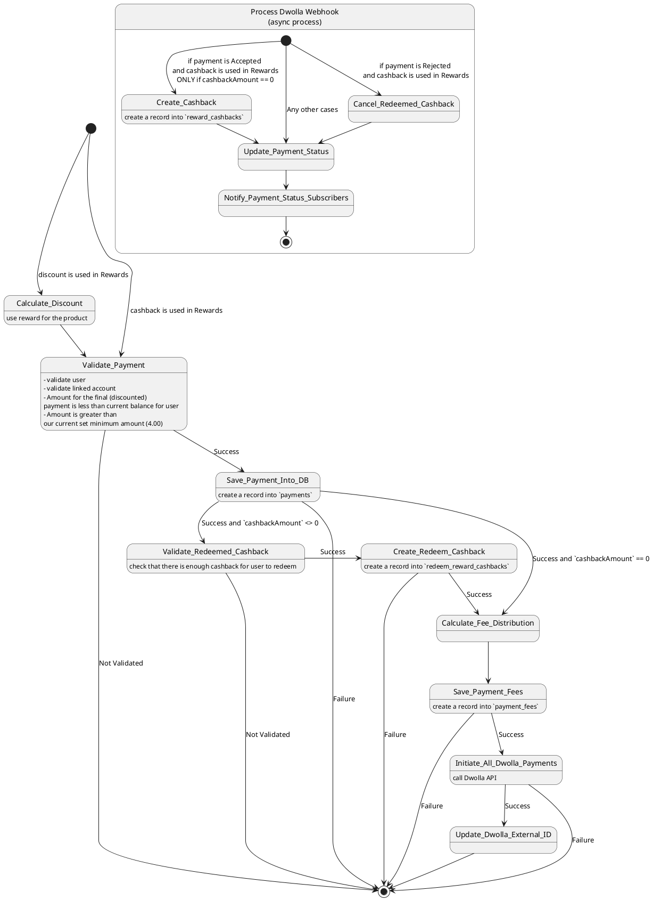
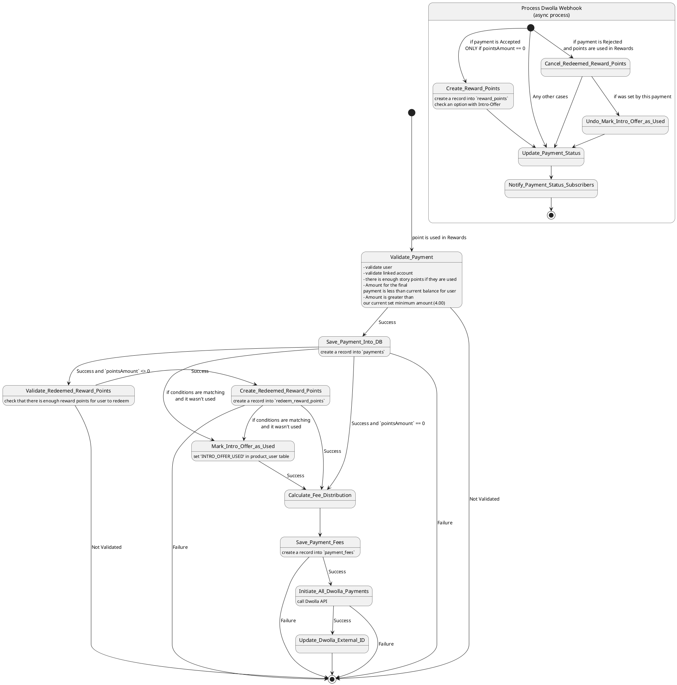
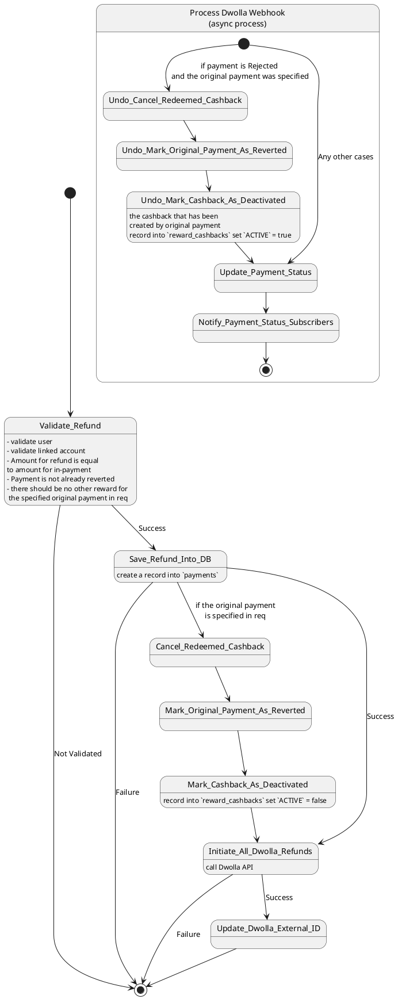
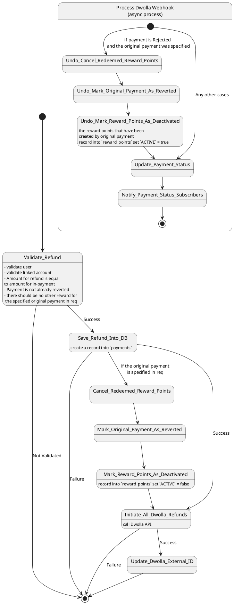

# Payment/Refund flow

<!-- TOC -->
* [Payment/Refund flow](#paymentrefund-flow)
  * [Payment (cashback/discount)](#payment-cashbackdiscount)
  * [Payment (Points System)](#payment-points-system)
  * [Refund (cashback/discount)](#refund-cashbackdiscount)
  * [Refund (Points System)](#refund-points-system)
<!-- TOC -->

## Payment (cashback/discount)

## Payment (Points System)

## Refund (cashback/discount)

## Refund (Points System)

